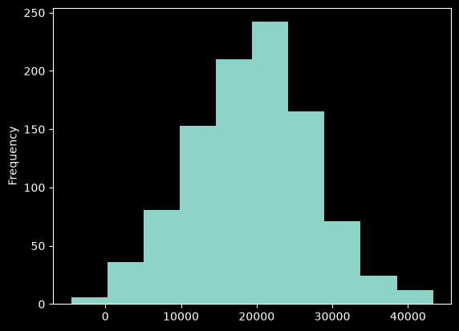
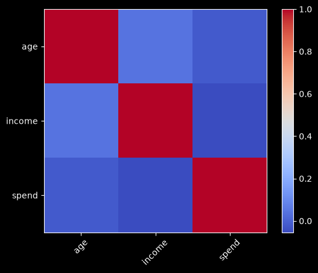

# Отчёт анализа

- Строк: 1000, колонок: 3

## Статистика

| count | mean | std | min | 25% | 50% | 75% | max | median |
|---|---|---|---|---|---|---|---|---|
| age | 1000.0 | 43.643 | 14.995880348529974 | 18.0 | 30.0 | 44.0 | 57.0 | 69.0 | 44.0 |
| income | 1000.0 | 49597.77143 | 15208.150114930253 | -4726.19 | 39869.9025 | 50032.5 | 59257.3725 | 97682.81 | 50032.5 |
| spend | 1000.0 | 19301.82981 | 8077.899501638085 | -4510.24 | 13966.6525 | 19737.47 | 24666.989999999998 | 43313.96 | 19737.47 |

## Пропуски

нет

## Корреляции

| age | income | spend |
|---|---|---|
| age | 1.0 | 0.041934537452302086 | -0.019523353099462196 |
| income | 0.041934537452302086 | 1.0 | -0.054017859379811684 |
| spend | -0.019523353099462196 | -0.054017859379811684 | 1.0 |

## Графики

